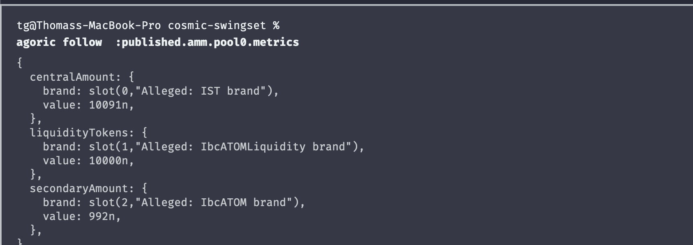

# inter-protocol notes
Notes taking using the agoric REPL while running the agoric economy setup


### opening vaults throw an error:
* it's expecting the Minted property to be `null`.
* removed the assertProposalShape in vaultDirector L#209 to see if that resolved it.

#### assertProposalShape Errors

- this method seems to be getting depreciated
  - [PR: refactor(store)!: move from Schema to Shape terminology](https://github.com/Agoric/agoric-sdk/pull/6072)
  - [OPEN: assertProposalShape is deprecated](https://github.com/Jorge-Lopes/stop-loss-amm/issues/29)

```sh
 { MINTED: { brand: Object [Alleged: IST brand] {}, value: 1n } } did not match expected { Minted: null }
```

### opening vaults (continued)
* this then lead to another assertProposalShape in vaultDirectory L#809.
- After removing the assert from vaultDirectory L#809., i received the following error.

> *i console.logs to vault contracts to get the result below*
```sh
2022-11-24T03:42:42.388Z SwingSet: vat: v34: vaultManager::: inside makeVaultKit
2022-11-24T03:42:42.396Z SwingSet: vat: v34: ::: inside makeVaultKit:::::::: after makeVault()  { vault: Object [Alleged: Vault self] {} }
2022-11-24T03:42:42.412Z SwingSet: vat: v34: removeByKey failed to remove fc3cf400000000000:1 [ratio, vaultId]: [ 4503599627370496000, '1' ]
2022-11-24T03:42:42.413Z SwingSet: vat: v34:   contents: []
2022-11-24T03:42:42.413Z SwingSet: vat: v34: vault 1 never stored during initVaultKit failure
2022-11-24T03:42:42.416Z SwingSet: ls: v34: Logging sent error stack (TypeError#1)
2022-11-24T03:42:42.416Z SwingSet: ls: v34: TypeError#1: multiplyHelper: cannot coerce undefined to object
2022-11-24T03:42:42.416Z SwingSet: ls: v34: TypeError: multiplyHelper: cannot coerce undefined to object
```

- need to investigate more, yet it is saying that the vault isn't being stored.\
- the error printed in REPL was `multiplyHelper` error. it seems to be using `null` instead of the correct payment record amount.
- it's saying that initVaultKit was a failure. oddly enough, `chargeAllVaults` fired a little bit later on.

```sh
2022-11-24T04:00:08.212Z SwingSet: vat: v34: ----- VM.5  10 chargeAllVaults Object [Alleged: IbcATOM brand] {} { updateTime: 1_669_262_400n }
2022-11-24T04:00:08.218Z SwingSet: vat: v34: ----- VM.5  11 chargeAllVaults complete Object [Alleged: IbcATOM brand] {}
```

### final thoughts (for now)

- I moved on to working with the AMM

```sh
# get AMM instance
ammInstance = E(home.agoricNames).lookup('instance', 'amm')
# get AMM public facet
ammPFacet = E(home.zoe).getPublicFacet(ammInstance)
# add an Liquidity Issuer
atomLiquidityIssuer = E(ammPFacet).addIssuer( atomIssuer,'IbcATOM');
# get Liqudity Brand - used for the Liquidity side of offer
atomLiquidityBrand = E(atomLiquidityIssuer).getBrand() # [Object Alleged: IbcATOMLiquidity brand]{}
# makeAmtHelper
makeAmt = brand => x => ({brand, value: x})

# creates proposal for AMM
# the Liquidity brand must be recieved via E(liquidityIssuer).getBrand() (see above)
makeAmmProposal = x => ({     
    give: {  
    Secondary: makeAmt(atomBrand)(x),       
    Central: makeAmt(runBrand)(x * 10n),     
    },    
    want: { 
        Liquidity: makeAmt(atomLiquidityBrand)(1000n) },   
     });
# create AMM proposal
ammProp = makeAmmProposal(1000n)
# withdraw paymetns
secondaryPmt = E(atomPurse).withdraw(ammProp.give.Secondary)
centralpmt = E(runPurse).withdraw(ammProp.give.Central)
# get addPoolInvitation
addPoolInvitation = E(ammPFacet).addPoolInvitation();
# use invitation to a new pool
addPoolSeat = E(home.zoe).offer(addPoolInvitation, ammProp, 
{ Central: centralpmt, Secondary: secondaryPmt }   );

E(addPoolSeat).getOfferResult() # liquidity added
```
### making a swap
```js
// use getInputPrice to figure out how much you need to swap
// this checks the price of 1000 atom in terms of IST
// the only "value" that matters is the first arguments value (ex. 1000n)
E(ammPFacet).getInputPrice(makeAmt(atomBrand)(1000n), makeAmt(runBrand)(1n));
//{"amountIn":{"brand":[Object Alleged: IbcATOM brand]{},"value":1000n},"amountOut":{"brand":[Object Alleged: IST brand]{},"value":4985n}}
// running again, get price of 5 atom in IST 
E(ammPFacet).getInputPrice(makeAmt(atomBrand)(5n), makeAmt(runBrand)(0n));
// {"amountIn":{"brand":[Object Alleged: IbcATOM brand]{},"value":5n},"amountOut":{"brand":[Object Alleged: IST brand]{},"value":47n}}

// you get the idea...
const { amountIn, amountOut} =E(ammPFacet).getInputPrice(makeAmt(atomBrand)(1n), makeAmt(runBrand)(0n));
// {"amountIn":{"brand":[Object Alleged: IbcATOM brand]{},"value":1n},"amountOut":{"brand":[Object Alleged: IST brand]{},"value":7n}}

// swapProposal using the amountIN and amountOut from getInputPrice
swapProposal = {     want: { Out: amountOut },     give: { In: amountIn  },   }
// withdraw amountIn from runPurse
istPayment = E(runPurs).withdraw(swapProp.give.In)
// make offer
swapperSeat = E(zoe).offer(swapInvite, swapProp, { In: runSwapPmt}  );
// get Payout
E(swapSeat).getOfferResult() // "Swap successfully completed."
```

## viewing the metrics
running the following command watches the amm
```sh
agoric follow  :published.amm.pool0.metrics
```

After the swap, my pool balances looked like the following. 
Note:
 * 10091n IST
 * 992 ATOM

